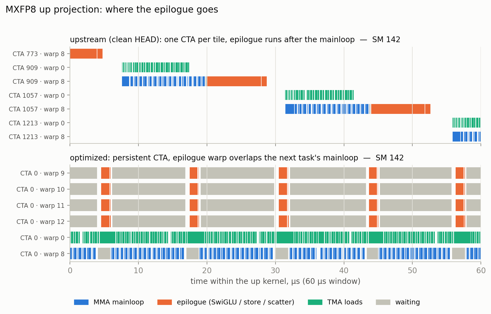
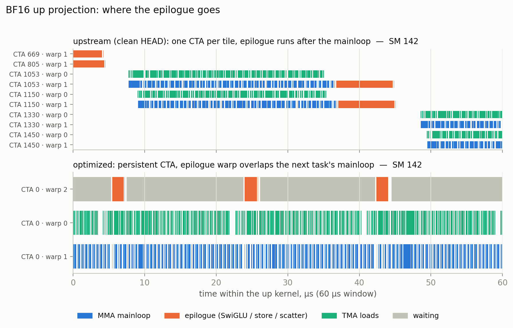
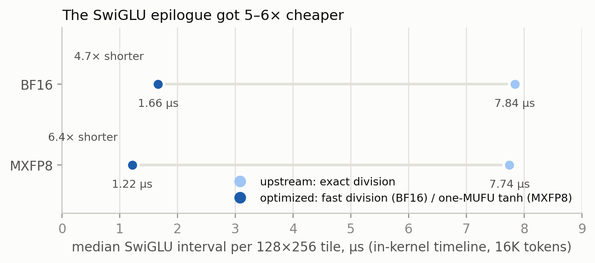
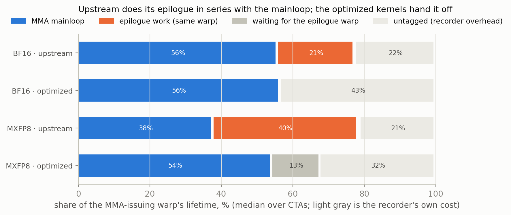
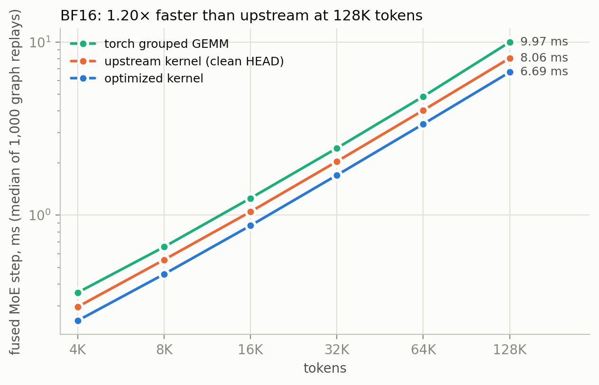
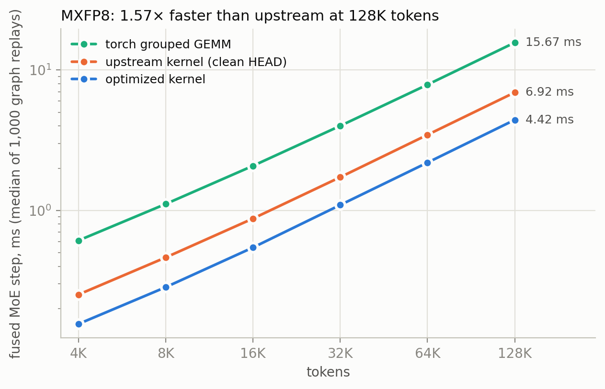

*September 2026.* *An optimization campaign on Prime Intellect's `prime-flash-moe`, measured against their clean tree on a B200. 1.20× faster in BF16, 1.60× faster in MXFP8, with every accepted change bracketed against the code it replaced.*

---

### Where we started

Prime Intellect's [prime-flash-moe](https://github.com/PrimeIntellect-ai/prime-flash-moe) fuses the whole MoE feed-forward block on Blackwell: gate/up GEMM, SwiGLU, down GEMM, and the top-k weighted scatter, written straight against `tcgen05`. Their launch post explains the design well, and the kernel is fast. We wanted to know how much was left.

So the first thing we did was not optimize anything. We measured where the kernel sat relative to the hardware, using the same benchmark script the repository ships, on a single B200:

| Path | Kernel's sustained rate | Empirical ceiling | Fraction |
|---|---:|---:|---:|
| BF16 | ~1,000 TFLOP/s | 1,391 TFLOP/s (cuBLAS dense, measured) | 72% |
| MXFP8 | ~1,150 TFLOP/s | 3,103 TFLOP/s (MX dense, measured) | 37% |

Two facts framed everything that followed. BF16 was already close to the ceiling, so gains there would come from small structural fixes, not from a new algorithm. MXFP8 was at 37% of a ceiling that NVIDIA's own grouped MX GEMM reaches 76% of. Something in the MXFP8 path was leaving half the tensor core idle, and the question was what.

### How we looked: a timeline, not a profiler

The obvious tool is Nsight Compute. On a shared cloud GPU it doesn't work: `ncu` needs performance-counter permission that providers disable, and you get `ERR_NVGPUCTRPERM` instead of a profile. This turned out to be a blessing, because it pushed us toward a tool that answers a better question.

We ported the per-warp event recorder from Gau-Nernst's [*tcgen05 for dummies*](https://gau-nernst.github.io/tcgen05/#persistent-kernel-with-static-scheduling) into the kernels. One elected lane per warp records `%globaltimer` timestamps around each phase it executes and writes them to a buffer; a script decodes the buffer into a Perfetto trace. It needs no permission because it is just the kernel writing to memory.

The events are the phases a tcgen05 kernel actually has:

```
producer warp:   WAIT_MMA (slot recycled?)  ->  ISSUE_TMA (loads in flight)
MMA warp:        WAIT_TMA (data landed?)    ->  ISSUE_MMA (tensor core busy)
epilogue warps:  WAIT_MAINLOOP (accumulator ready?) -> SWIGLU / EPILOGUE -> WORKSPACE_STORE
```

What a trace like this shows, and a counter-based profile can't, is *exposure*: time during which the SM's tensor core is idle because nothing on that SM is issuing MMAs. Here is the whole idea in two lines.

```
per-tile kernel:   [fill][=== mainloop ===][epilogue][fill][=== mainloop ===][epilogue]
tensor core busy:        ^^^^^^^^^^^^^^^^^^          ^^^^^^^^^^^^^^^^^^
                                            ^ idle ^^^^^^^^^^^ idle
```

Every microsecond in that idle stretch adds a microsecond to the step. One rule we set before starting and never broke: the timeline attributes, it does not decide. Every candidate was accepted or rejected on production timing with the recorder compiled out, measured as clean-A / candidate / clean-B brackets on one pinned GPU, replicated on a second allocation.

### What the trace said


*MXFP8 up kernel on one SM, 60 µs window: upstream above, optimized below, colored by phase.*


*The same window for BF16. The optimized MMA warp runs with no gaps because of the double accumulator.*

The mainloops were never the problem. Inside the K-loop the upstream kernel issues at roughly 350 ns per 128-K stage against a tensor-core time of about 400 ns, so the tensor core is fed. The loss is all outside the mainloop, and it comes in three pieces of comparable size:

1. **The epilogue is exposed.** In the upstream design the same warps that drove the mainloop stop, convert the accumulator through SwiGLU, and store it, before the next tile starts. BF16 runs two CTAs per SM so one CTA's mainloop partly covers the other's epilogue. MXFP8 can't: a 256-column block-scaled accumulator plus its scale-factor slots occupies 320 of the 512 tensor-memory columns, so there is one CTA per SM and nothing covers the epilogue at all. In the trace, the epilogue is 21% of a BF16 tile's life and **40% of an MXFP8 up tile's** life.
2. **The SwiGLU itself is expensive.** The interval containing the SwiGLU loop ran 7.8 µs per 128×256 tile in both dtypes.
3. **Routing is serial.** `moe_align`, which sorts token-expert pairs by expert and pads them to tile boundaries, ran as one CTA doing two passes over every routing entry. At 128K tokens that is around a millisecond on one SM while 147 others wait.

That list is the campaign. Everything that worked either made an exposed piece cheaper, hid it behind the mainloop, or parallelized it.

### Cheapening the epilogue

#### One line

The shared SwiGLU helper computed the sigmoid with an exact division:

```cpp
return w*(x/(1.f+__expf(-x)));
```

IEEE division on the GPU is a reciprocal plus refinement plus special-case handling, and it was the most expensive sequence in a fully exposed epilogue. Replacing it with the approximate form:

```cpp
return w*__fdividef(x, 1.f+__expf(-x));
```

is the highest-value line of the whole campaign. We measured it alone, clean upstream against upstream plus only this line, same GPU, the repository's own benchmark, median of 1,000 graph replays:

| Tokens | BF16 change | MXFP8 change |
|---:|---:|---:|
| 4K | −5.7% | −17.7% |
| 16K | −6.1% | −18.1% |
| 128K | −5.9% | −15.9% |

Three times the effect on MXFP8, for the reason section 3 gave: its epilogue was fully exposed, so every instruction removed came straight off the step. Output error against the reference was identical to the digit.

#### One MUFU instead of two

On the MXFP8 path the SwiGLU output is immediately requantized to e4m3, whose quantization step is 12.5% relative. That is far coarser than the error of the hardware `tanh` approximation, so the sigmoid can be written as a single MUFU op:

```cpp
float t; asm("tanh.approx.f32 %0, %1;" : "=f"(t) : "f"(0.5f*x));
return w*x*fmaf(0.5f, t, 0.5f);   // silu(x) = x * (0.5 + 0.5*tanh(x/2))
```

Bracketed on top of the fast division: another 2.9–3.9%. In the timeline the SwiGLU interval per tile went from 7.8 µs to 1.7 µs (BF16, fast division) and 1.2 µs (MXFP8, tanh).



We also tried computing the SwiGLU in packed `bf16x2`, two elements per instruction. It was 1.3–3.2% slower: the pack/unpack conversions cost more than the halved MUFU count saved, and the rounding of the pre-activations became visible after requantization. Rejected and removed.

### Hiding the epilogue

Cheaper is good; hidden is better. The upstream kernel launches one CTA per output tile and each CTA lives through fill, mainloop, epilogue, exit. We replaced that on the `split=True` path with **persistent workers**: one CTA per SM that walks a static round-robin list of tiles, streaming TMA loads continuously across tile boundaries, so the pipeline never refills and CTA turnover disappears.

On BF16 the persistent worker also gets a **double accumulator**. Tensor memory holds two 256-column accumulators, so the MMA warp fills accumulator n&1 for task n while four epilogue warps drain task n−1 through SwiGLU and the workspace store. The roles never hand anything off; each computes the same static sequence.

```
MMA warp:       [=== mainloop n ===][=== mainloop n+1 ===][=== mainloop n+2 ===]
epilogue warps:                     [epilogue n]          [epilogue n+1]
tensor core:    busy the whole way through
```

The trace confirms it worked. In the optimized BF16 up kernel the epilogue warp spends 87% of its life waiting for the accumulator, which is the picture of an epilogue that is small relative to the mainloop and fully overlapped. Bracketed: 3.9–4.3% for the up worker, 4.0–6.0% for the down.


*The light-gray segment is untagged time, mostly the recorder's own cost of writing timestamps; it inflates every bar equally, so read the blue, orange and mid-gray segments against each other.*

MXFP8 can't have the second accumulator, so its persistent workers keep one and reclaim setup, fill, streaming, and turnover instead: 7.5–8.0% for the up worker, 7.6–9.4% for the down. What remains exposed there is the handoff itself, about 1.9 µs per up task (19%) and 1.2 µs per down task (26%), and section 8 is about what happened when we tried to hide that too.

### The down projection

The down kernel's epilogue scales each row by its routing weight and reduce-adds it into the output, since a token's top-k experts all land in the same row. Upstream did this with per-thread `red.global` atomics from registers, which means the accumulator can't be released until the last atomic has issued.

The change: stage the scaled bf16 row in shared memory and hand it to the async proxy as one bulk reduce.

```cpp
cp.reduce.async.bulk.add.bf16  [out_row], [smem_row], 512;   // one op per 512-byte row
```

The epilogue thread releases the accumulator as soon as its row is staged; the reduction completes on the copy engine under the next task's mainloop, and the thread only waits on its own bulk group before restaging that row. Three pipeline stages fit alongside the staging tile. Bracketed on top of the persistent worker: 4.8–7.4%, and the 1.6 µs of bulk-issue time now sits entirely after the accumulator release, hidden.

The lesson of this pair of changes is worth stating plainly: for an exposed epilogue, moving the work to the async proxy so it overlaps the next task was worth far more than making the work cheaper.

### Routing

`moe_align` became three launches: chunk CTAs build per-expert histograms over 2,048 routing entries each, one small CTA turns the counts into padded expert offsets and per-chunk scatter bases, and the chunk CTAs scatter into disjoint ranges. Below 32 chunks it stays on the original single-CTA kernel, because three launches lose on small routing lists. Alignment latency fell 63–67% at 16K tokens and 89–90% at 128K, which is worth about 5% of the MXFP8 step at 128K and nothing at 4K.

### What didn't work, and why

A post like this usually shows only the wins. The rejections taught us more about the machine, so here they are with their brackets.

**A second accumulator through narrower tiles (N=128).** Two 128-column block-scaled accumulators fit in tensor memory. The kernel was correct and 1–2% *slower*: a 128×128×32 MMA does half the work of a 128×256×32 one for the same issue cost, and the issuing thread became the bottleneck.

**A second accumulator through `cta_group::2`.** Pair two SMs so one 256×128 MMA instruction drives both, each CTA holding 128 accumulator columns, so two fit. We built it: collective tensor-memory allocation, the weight tile split along N across the pair, scale factors replicated per CTA and copied with the pair form of `tcgen05.cp`, multicast commits, a follower-to-leader ready barrier. It passed all 193 reference configurations. It was **28–39% slower.** A pair instruction is issued once for two SMs, so at N=128 each SM again does half the work per issue, and the leader's single thread now has to feed two tensor pipes. Same law as the N=128 tile, and it costs far more than the 19–26% handoff it hides. There is no configuration of this kernel that hides the handoff without paying the issue rate: N=192 would fit but isn't integral for these shapes, N=256 needs 576 columns of 512.

**Byte-reduction ideas.** TMA gather4 for the activation tile, activation multicast across a cluster, paired column tiles. Each saved bytes or instructions and each lost, because they increased arrival latency or reduced scheduling freedom. A few large swizzled tile transactions beat fewer bytes delivered awkwardly.

**A twelve-warp epilogue.** Flat. Each tensor-memory lane quadrant is served by one SM sub-partition, so adding warps to the same quadrant adds nothing.

The common thread: on this hardware the tcgen05 issue rate caps how much work a single instruction can carry per SM, and anything that shrinks that below the 128×256 tile loses more than it gains.

### Benchmarks on a B200

Same protocol as upstream's post, same shapes (E=32, top_k=4, K=2048, H=1024, `split=True`), with the repository's own benchmark: `python benchmark/benchmark.py --check --iters 1000 --warmup 10`. Clean upstream A, the optimized tree, then clean upstream B, all in one allocation; the table uses the midpoint of the two clean runs, which agreed within 0.7% everywhere.





| Path | Tokens | Upstream | Optimized | Speedup |
|---|---:|---:|---:|---:|
| BF16 | 4K | 0.296 ms | 0.246 ms | 1.20× |
| BF16 | 128K | 8.055 ms | 6.688 ms | 1.20× |
| MXFP8 | 4K | 0.252 ms | 0.156 ms | 1.62× |
| MXFP8 | 128K | 6.923 ms | 4.417 ms | 1.57× |

Geometric mean over six token sizes: **1.203× BF16, 1.596× MXFP8**. Against torch's grouped GEMM path the optimized kernel is 1.43–1.49× faster in BF16 and 3.55–3.93× faster in MXFP8 including the vendor's requantization step (1.73–2.02× against the grouped GEMMs alone). Both trees pass all 48 BF16 and 193 MXFP8 reference configurations; the largest error against the PyTorch reference is 7.3e-4 (BF16) and 1.7e-3 (MXFP8).

#### Environment, honestly

One NVIDIA B200, driver 580.95.05, CUDA 13.0, PyTorch 2.13.0+cu130. The benchmark is single-GPU and pins one device; the eight-GPU node in upstream's post is the chassis, not the workload. One thing we measured that nameplate specs hide: this kernel runs the GPU into its 1000 W power cap. `nvidia-smi` sampled during the benchmark shows the SM clock between 1372 and 1965 MHz, medians of 1770 and 1950 MHz on two allocations, with the power-cap throttle reason active roughly half the time. Absolute milliseconds on any B200 carry a few-percent band from that; the speedup ratios don't, because the clean and optimized builds alternate on the same GPU within minutes.

### Summary

Upstream's kernel had its mainloops right. What it left on the table was everything around them: an epilogue running in series with the tensor core, a SwiGLU with an exact division inside it, a serial routing kernel. Making the epilogue cheaper was worth 6% in BF16 and 17% in MXFP8 from a single line. Making it hidden, with persistent workers and a double accumulator where tensor memory allows one, was worth another 8–17%. Moving the down reduction onto the async proxy and parallelizing routing took the rest. The things that didn't work all failed the same way, by trading tensor-core work per instruction for something else, and that turned out to be the one trade Blackwell doesn't make.

Everything here is reproducible from [the repository](https://github.com/Itssshikhar/prime-super-flash-moe/tree/readme-review-fixes): the accepted-change brackets under `artifacts/accepted/`, the three-way comparison behind the table, the fast-division experiment, the clock probe, and the four intra-kernel traces (upstream and optimized, both dtypes) that the figures were rendered from.

### Appendix: the traces behind the figures

The four intra-kernel timelines are in the repository under [`docs/blog/traces/`](https://github.com/Itssshikhar/prime-super-flash-moe/tree/readme-review-fixes/docs/blog/traces), as gzipped Chrome/Perfetto JSON. Open any of them at [ui.perfetto.dev](https://ui.perfetto.dev) (drag the `.json.gz` onto the page, or Ctrl+O); each SM appears as a process, each recording warp as a thread, and every phase as a colored slice named by its tag.

| File | Tree | dtype | Events |
|---|---|---|---:|
| [`head-bf16-16384.json.gz`](https://github.com/Itssshikhar/prime-super-flash-moe/blob/readme-review-fixes/docs/blog/traces/head-bf16-16384.json.gz) | upstream `1820183` | BF16 | 698,880 |
| [`current-bf16-16384.json.gz`](https://github.com/Itssshikhar/prime-super-flash-moe/blob/readme-review-fixes/docs/blog/traces/current-bf16-16384.json.gz) | optimized | BF16 | 673,968 |
| [`head-mxfp8-16384.json.gz`](https://github.com/Itssshikhar/prime-super-flash-moe/blob/readme-review-fixes/docs/blog/traces/head-mxfp8-16384.json.gz) | upstream `1820183` | MXFP8 | 422,400 |
| [`current-mxfp8-16384.json.gz`](https://github.com/Itssshikhar/prime-super-flash-moe/blob/readme-review-fixes/docs/blog/traces/current-mxfp8-16384.json.gz) | optimized | MXFP8 | 534,000 |

All four were captured in one B200 allocation at 16K tokens by [`benchmark/modal_timeline_capture.py`](https://github.com/Itssshikhar/prime-super-flash-moe/blob/readme-review-fixes/benchmark/modal_timeline_capture.py), after each build passed its full reference suite (48/48 BF16, 193/193 MXFP8). The `*-summary.json` files beside them hold per-tag counts and median durations; `timeline-capture-summary.json` holds the gates and buffer sizes.

The timeline figures were cut from these traces by [`make_figures.py`](https://github.com/Itssshikhar/prime-super-flash-moe/blob/readme-review-fixes/docs/blog/make_figures.py), so they can be checked against the raw data. Each panel is the process named **SM 142**, up kernel only, a 60 µs window starting at these trace times (µs since the first event in that trace):

| Figure panel | Trace | Window |
|---|---|---|
| `timeline-bf16-up`, upstream | `head-bf16` | 119.9 → 179.9 µs |
| `timeline-bf16-up`, optimized | `current-bf16` | 102.7 → 162.7 µs |
| `timeline-mxfp8-up`, upstream | `head-mxfp8` | 137.4 → 197.4 µs |
| `timeline-mxfp8-up`, optimized | `current-mxfp8` | 74.1 → 134.1 µs |

What to look for in Perfetto, in the upstream traces: on any SM, each CTA's consumer warp shows a run of `ISSUE_MMA`/`WAIT_TMA` slices followed by one long `SWIGLU` slice, and the next CTA's mainloop does not start until it ends. In the optimized traces: on any SM, one CTA for the whole kernel; the MMA warp's `ISSUE_MMA` slices run back to back with no gaps in BF16 and with short `WAIT_EPILOGUE` gaps in MXFP8, while the epilogue warps sit in long `WAIT_MAINLOOP` slices broken by brief `SWIGLU` bursts.

Two things to know when reading them. The recorder itself costs time (a global write per slice boundary), so absolute spans are inflated relative to production and only the ratios and per-slice medians should be quoted. And the `current-bf16` capture overflowed its per-warp buffer on 296 rows; the retained prefix is complete and the medians are unaffected, but the last tasks of those warps are missing from the trace.

### Prior work and acknowledgements

This work builds directly on Prime Intellect's `prime-flash-moe`, including its fused-kernel design, API, tests, and benchmark. The intra-kernel timeline recorder is a port of the one described in Gau-Nernst's *tcgen05 for dummies*, which is also the best introduction to persistent tcgen05 kernels we know of.

