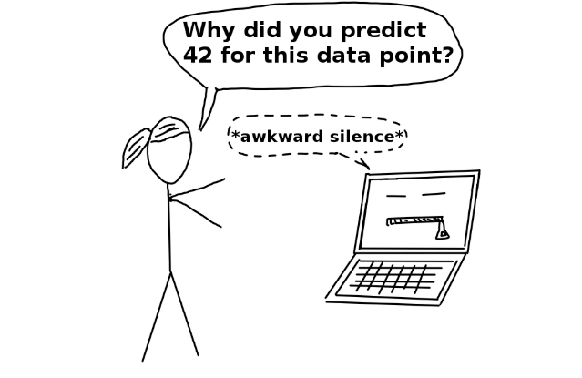
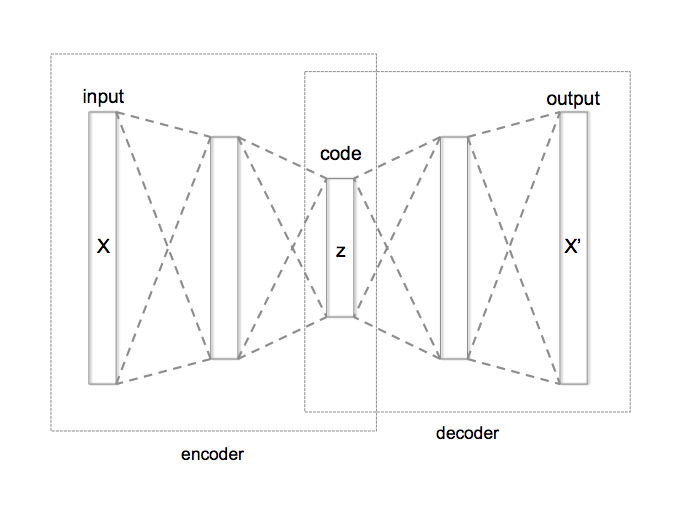
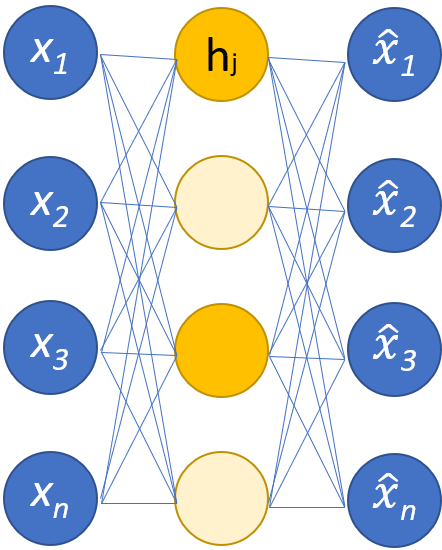

Machine Learning models and LLMs have been around us for quite a while now, but even after all this, we still do not know about how things work inside these Large Language Models. We call this phenomenon as **Black Boxes** because we don't understand their inner working, making it difficult to explain the results.

Interpretability aims to solve this same problem. So, how do we do that?

This is where Sparse Autoencoder comes in clutch. Using SAEs, we can try to understand the model's computation into understandable components. So, I thought to write about my understanding of SAEs and an explanation of how they work.

### What is up with Interpretability?

Interpretability, in the simplest terms, can be defined as how changes in inputs to a model effect the output. Interpretability is cause and effect that can be observed in a system. Interpretability, is often confused with Explainability. Explainability, tells us to know the exact internals of a system, meanwhile, Interpretability tells us to know the internals without knowing why.

For models, that uses Linear Regression, are highly transparent and interpretable. But for models using deep learning algorithms, having various **Hidden Layers**, are not so much interpretable. 

Though, not all machine learning systems require interpretability. Interpretability is not required when the outputs do not have much significance or when the outputs are already tested in real world applications.

Source: [Interpretable-ml-book](https://christophm.github.io/interpretable-ml-book/)

### Challenges with Interpretability

Even in the simplest of the Neural Network, there exists a neuron as a fundamental component. In a Large Language Models, a single neuron rarely corresponds to a single fact/output, meaning a neuron corresponds to combinations of previous neurons. This concept is called [Superposition](https://transformer-circuits.pub/2022/toy_model/).

Superposition occurs when because many variables existing in the latent space are sparse. For example, the fact that, India's Independence Day is on 15th of August, may come in one in a billion training tokens, still LLMs will learn this fact along with several others.

Sparse Autoencoders aims to break down internal components of the neural networks into an understandable component. They are inspired by the sparse coding hypothesis in neuroscience. Sparse Autoencoders are variants of Autoencoders, such that they include more hidden units than input, but only a small number of those are active at the same time. Having sparsity in the model, improves performance on classification tasks.

Source: [Wikipedia](https://en.wikipedia.org/wiki/Autoencoder#/media/File:Autoencoder_structure.png)

An Autoencoder usually takes in an input, compresses it and reconstructs the imperfect copy of the input data. For example, it may take 50 dimensional vector as an input, feeds it into the encoder layer making the input a 25 dimensional vector, and then passing it to a decoder layer to convert it back into a 50 dimensional vector. This process is hardly perfect as it is impossible to get back the same input.

### How does Sparse Autoencoder Work?

Sparse Autoencoder, like any other autoencoder, simply has two main parts: an encoder that maps the input into a space, and a decoder reconstructs the message from the space. An optimal Autoencoder would perform the reconstruction as perfect as possible, with perfection being defined by the reconstruction quality function, let's say, d.

In the simplest way, perfectly copying the task can be done by duplicating the original signal.

Typically in a SAE, the hidden layer or intermediate vector, are equal to or greater than the dimension of the input layer. Given, a simple task, SAEs can learn the Identity Function, not revealing anything interesting to us and become useless.
 

To give a additional constraint, we add sparsity to the training loss, which makes it SAE to use sparse intermediate vector. In the above image, the yellow nodes in the intermediate layer are activated and white ones are inactive, representing a sparse network. For example, we could expand the 100 dimensional input into a 200 dimensional encoded representation vector, and we could train the SAE to only have ~20 nonzero elements in the encoded representation.

The Key here is to take a different approach in training. Once the encoder uses ReLU to suppress the negative values, SAEs go one step even further and use L1-Loss on the result to encourage sparsity by penalizing the absolute values. This can be achieved by adding a penalty term to the loss function, which is the absolute values of the weights. The final remaining non-zero weights, are then used for model's performance.

We use SAEs in the intermediate activations with a neural network, which can also be composed of many layers. During forward pass, there are intermediate activations within and between the layers. For example, the new [Llama 3.1 70B](https://ai.meta.com/blog/meta-llama-3-1/) has 80 layers. During the forward pass, there is a 32,768 dimensional vector for each input token that is passed from layer to layer.

